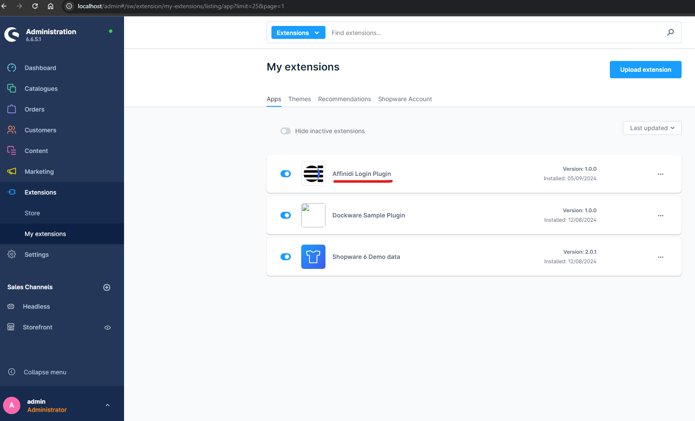
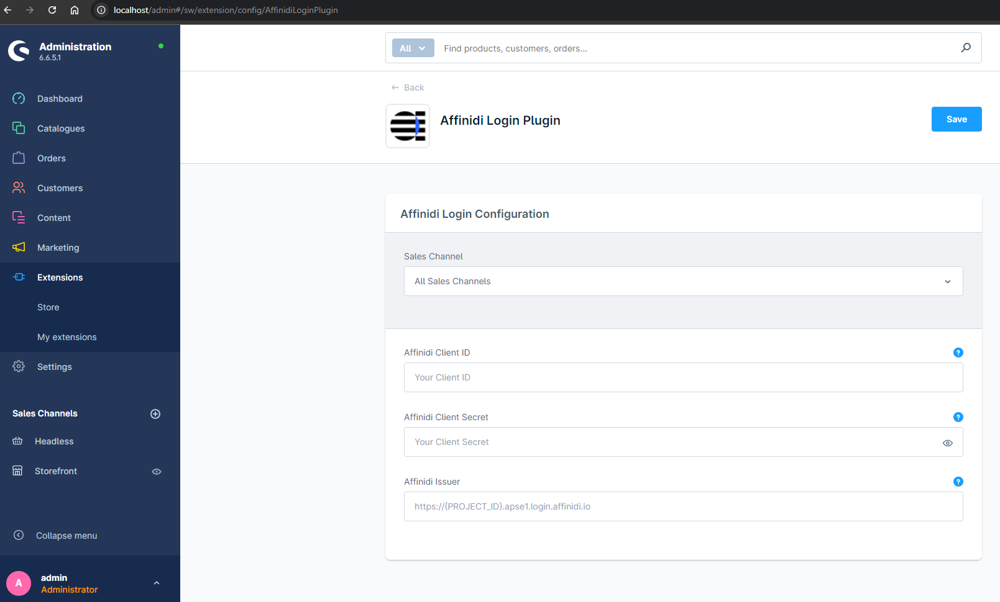
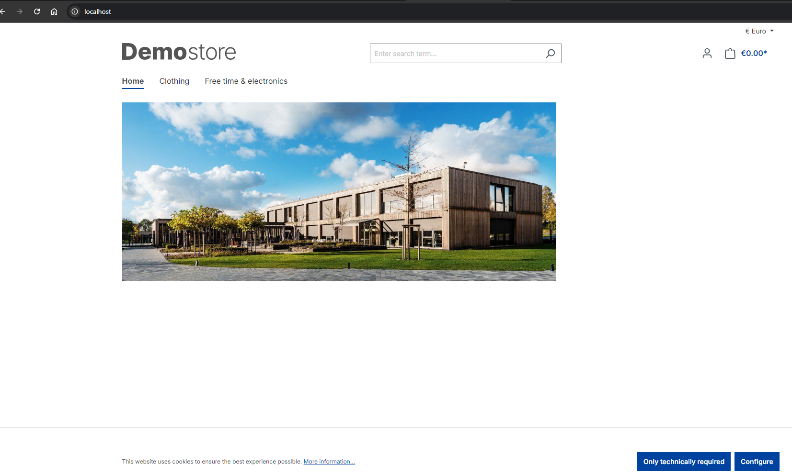
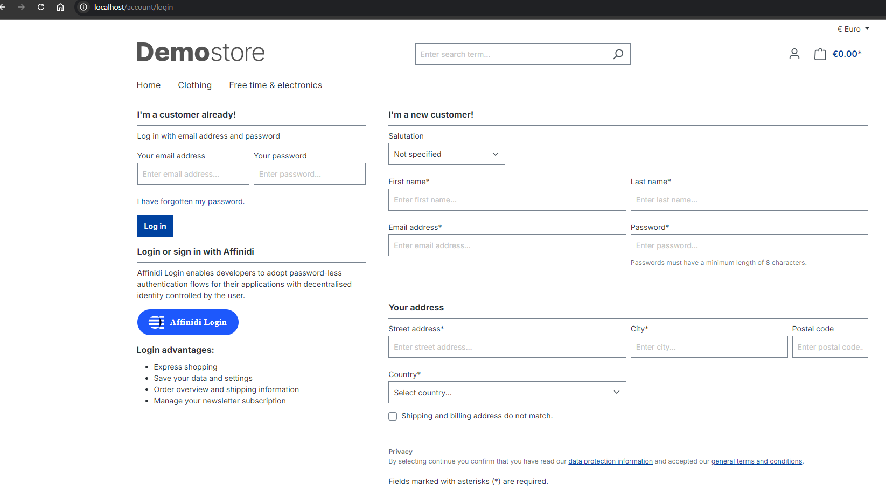
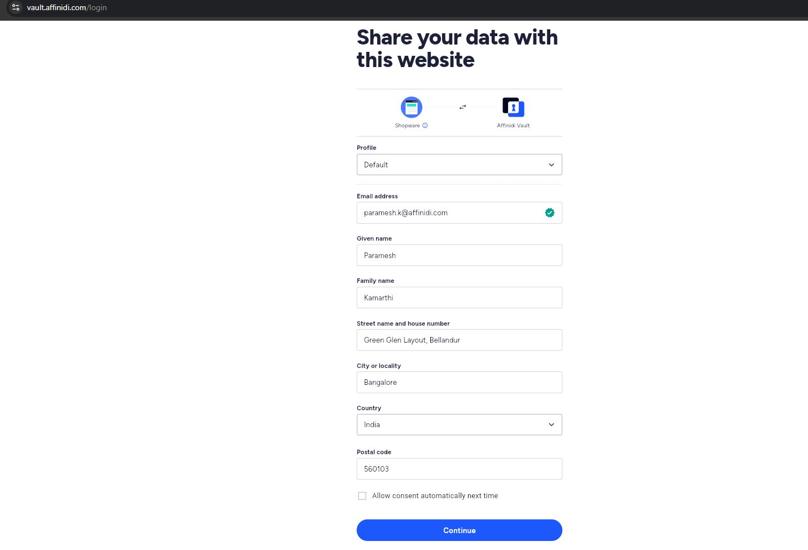
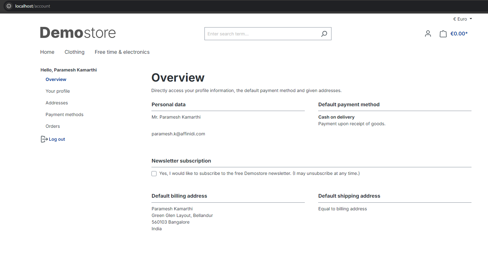
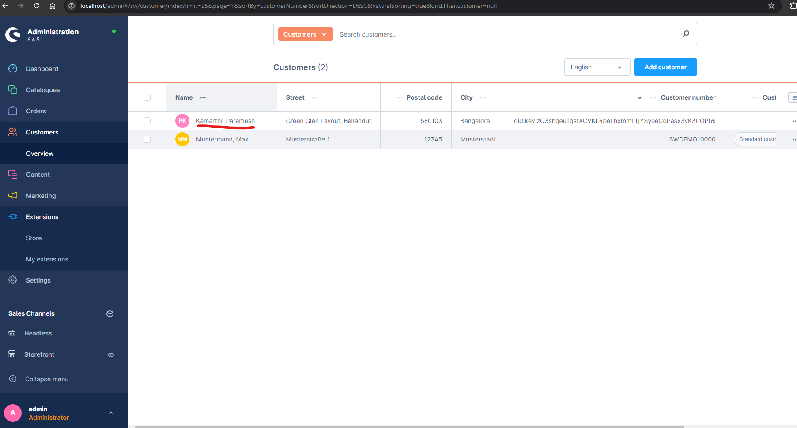

# Affinidi Login Plugin for Shopware

Affinidi Login - Passwordless Authentication provides an alternative way to securely authenticate to Shopware Stores using Affinidi Vault as the identity provider managed by the end-user. It integrates with Affinidi Login to enable passwordless login for a seamless user experience.

Explore our [documentation](https://docs.affinidi.com/docs) on how Holistic Identity and the Affinidi Trust Network enable developers to create privacy-preserving applications and empower consumers to control and manage their data.

This plugin uses [laravel-socialite-affinidi](https://packagist.org/packages/affinidi/laravel-socialite-affinidi) for implementing OAuth2 as `Affinidi Provider`, which internally using `hybridauth/hybridauth` package.

**Note**: This is POC, not to be used in production

## Setup Shopware

1. Run the below command to create a shopware container in the local machine

```
docker-compose up -d
```

2. Check Shopware Admin
   Open http://localhost/admin in your browser after the installation has finished. You should see the Shopware admin interface.

   The default credentials are:
   User: `admin`
   Password: `shopware`

3. Check Shopware Store
   Open http://localhost/ in your browser, You should see the Shopware store with some default products.

4. (Optional) If you want sync shopware source code from the container

```
docker cp shopware:/var/www/html/. ./src
```

## Install Affinidi Login Plugin

1. **Option 1** : Zip the directory `AffinidiLoginPlugin` and upload it in [Shopware Admin Portal](http://localhost/admin) `Extensions -> My extensions -> Upload extension`

2. **Option 2** : Copy the plugin from local to plugins directory of shopware code running inside a container using below command

```
docker cp ./AffinidiLoginPlugin shopware:/var/www/html/custom/plugins/.
```

3. Post that open the [Shopware Admin Portal](http://localhost/admin) and then install, activate the plugin
   

## Set up your Affinidi Login configuration

1. Follow [this link](https://docs.affinidi.com/docs/affinidi-login/login-configuration/#using-affinidi-portal) to create your Affinidi login configuration with below details

   - `Name` as your Shopware store name e.g. `Shopware Store`
   - `Redirect URIs` as `http://localhost/affinidi/callback` (replace localhost with your domain name)
   - To request the user’s email, name & address, Use the below **Presentation Definition** (presentationDefinition) and **ID Token Mapping** (idTokenMapping)
     - `presentationDefinition` - Replace the content from [here](./AffinidiLoginPlugin/docs/presentationDefinition.json)
     - `idTokenMapping` - Replace the content from [here](./AffinidiLoginPlugin/docs/idTokenMapping.json)

2. Copy your **Client ID**, **Client Secret** and **Issuer** from your login configuration

3. Update Login Configuration with above values by navigating to [Shopware Admin Portal](http://localhost/admin) > Extensions > My extensions > Configure Affinidi Login Plugin
   

# Few Screenshots for Login Flow

Shopware Store Landing Page:


Shopware Store Login Page:


Affinidi Vault Consent Page during Affinidi Login Flow:


Shopware Store Accounts Page post Login:


Shopware Admin Portal Customer List Page:


### Handy commands (for my development)

- Remove plugin, need to run this command inside the container

```
sudo rm -rf custom/plugins/AffinidiLoginPlugin
```

- Commands to clear cache etc..

```
php bin/console cache:clear
php bin/console plugin:refresh
php bin/console theme:compile
php bin/console plugin:install --activate AffinidiLoginPlugin
php bin/console plugin:uninstall AffinidiLoginPlugin --keep-user-data false
php bin/console debug:router
```

-- Copy plugin or shopware Code to local

```
mkdir temp
docker cp shopware:/var/www/html/custom/plugins/AffinidiLoginPlugin ./temp/.

docker cp shopware:/var/www/html/vendor/shopware ./temp/.
```
